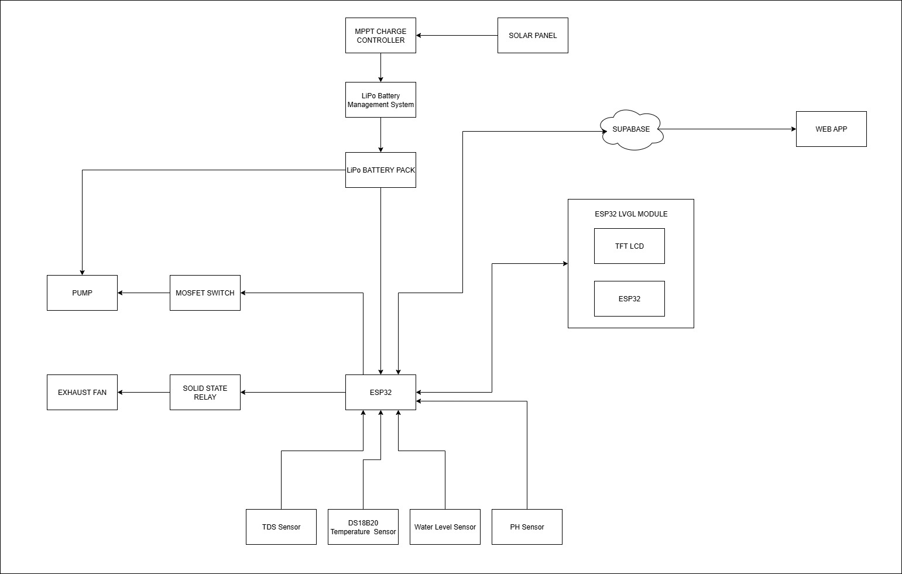

# AeroTech: A Sensor-Based Aeroponics System for Efficient Vegetable Growth

AeroTech is an automated, sensor-driven aeroponics system designed to enhance vegetable farming efficiency through real-time monitoring, adaptive climate control, and remote data access. Powered by solar energy, AeroTech aims to provide a sustainable and intelligent solution for soilless agriculture.

---

## Features

- **Sensor Monitoring**: Real-time tracking of:

  - pH Level
  - Total Dissolved Solids (TDS)
  - Water Level
  - Temperature

- **Automation**:

  - Microcontroller-controlled pumps and fans
  - Adaptive environmental regulation based on sensor data
  - Touchscreen Interface (LVGL)

- **Remote Access & Alerts**:

  - Cloud Dashboard for live data logging and analytics
  - Real-time monitoring via Web Application

- **Sustainable Power**:
  - Solar energy integration with battery backup
  - Optimized for energy efficiency in remote or off-grid locations

---

## Tech Stack

### Embedded Firmware

- **Microcontroller**: ESP32
- **Framework**: Arduino
- **UI Library**: LVGL (Light and Versatile Graphics Library)
- **Communication**: ESP-NOW (Device-to-Device), WiFi (Cloud Connectivity)

### Web Dashboard

- **Framework**: Next.js 15
- **Library**: React 19
- **Database**: Supabase
- **Styling**: Tailwind CSS

### Hardware

- **Sensors**: pH, TDS, Water Level, Temperature
- **Actuators**: Water Pumps, Misters, Fans
- **Power**: Solar Panels, Battery Management System

---

## System Architecture



---

## Project Structure

```
AeroTech/
├── Code/
│   ├── Embedded/
│   │   ├── AeroTech_Main/   # Main Controller Firmware (ESP32 + LVGL)
│   │   └── AeroTech_Sensor/ # Sensor Node Firmware
│   └── Web/
│       └── aerotech/        # Web Dashboard (Next.js + Supabase)
├── Docs/                    # Schematics, PCB Designs, Block Diagrams
├── Assets/                  # Project Images and Resources
└── README.md                # Project Overview
```

---

## Getting Started

### Firmware (ESP32)

1. Open the project in VS Code with PlatformIO or Arduino IDE.
2. Ensure necessary libraries are installed (LVGL, TFT_eSPI, etc.).
3. Upload `AeroTech_Main` to the main controller unit.
4. Upload `AeroTech_Sensor` to the sensor nodes.

### Web Dashboard

1. Navigate to `Code/Web/aerotech`.
2. Install dependencies:
   ```bash
   npm install
   ```
3. Run the development server:
   ```bash
   npm run dev
   ```

---

## License

This project is licensed under the MIT License.

---

## Acknowledgements

Developed as part of the AeroTech initiative to improve sustainable farming practices using IoT and embedded systems.
